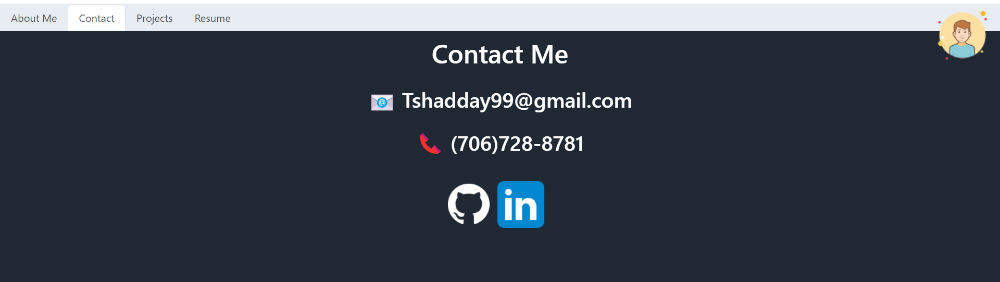
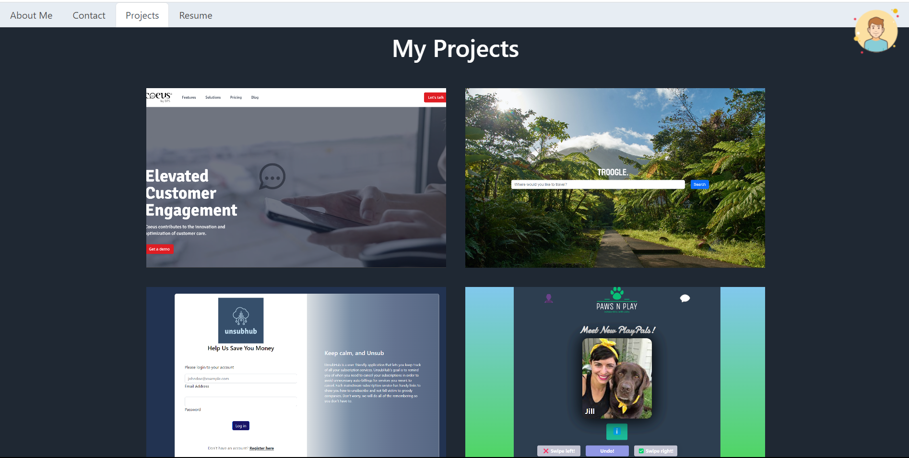
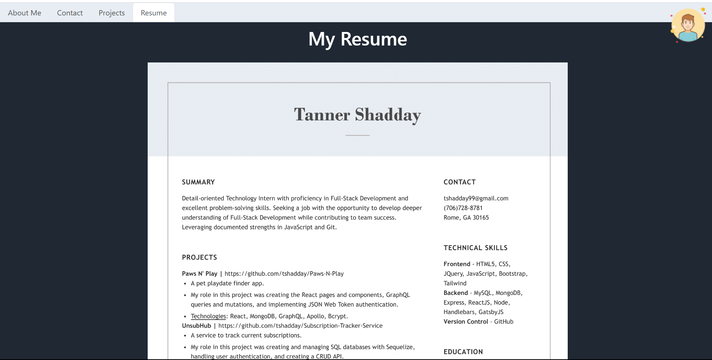

# React-Portfolio

## Description
This application is my own personal portfolio built using React. It features conditional rendering to display different elements to the page depending on what was clicked in the nav bar.

## Images

## Deployed Application
[My React Profile](https://tshadday.github.io/React-Portfolio/#Projects)

## Questions
For any question, feel free to email me at tshadday99@gmail.com. Check out my other GitHub applications: [tshadday](https://github.com/tshadday)